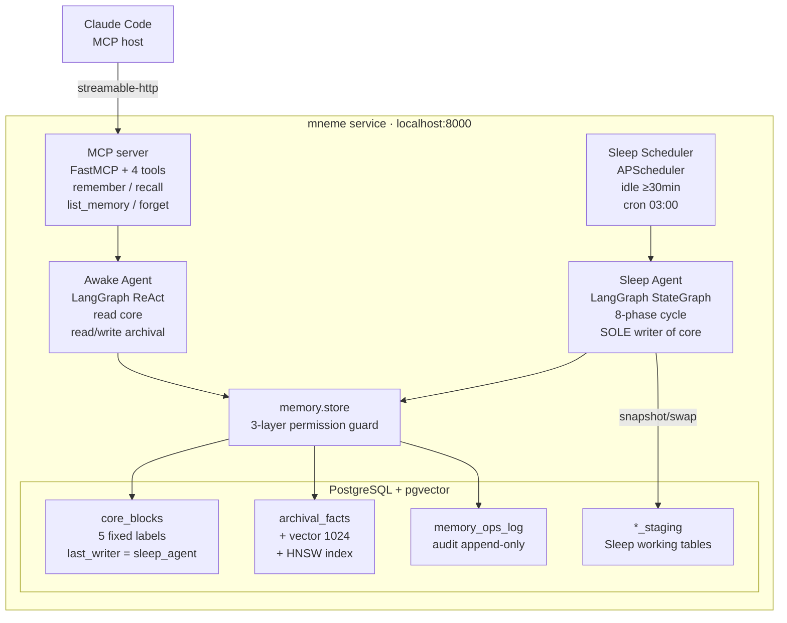

# Mneme

> **Letta-inspired memory-as-a-service for Claude Code.** Awake/Sleep 双 agent + read-only primary,严格按 Letta sleep-time compute paper(arxiv 2504.13171)落地。

[](https://www.python.org/) [](docs/construction-log/) [](LICENSE)

> **Mneme** 读作 "NEE-mee" / "尼米",来自记忆女神 Mneme。历史代号为 `dream`。

---

## 是什么

通过 **MCP**(Model Context Protocol)给 Claude Code 加一层**跨 project 的用户画像长期记忆**——补 Claude Code 自带 `CLAUDE.md` / per-project auto-memory **故意不覆盖**的 cross-project 空白。

| 谁负责 | 范围 |
|---|---|
| Claude Code 自己 | 当前 session context / `CLAUDE.md` / project-scoped auto-memory |
| **mneme(本项目)** | **跨 project 的"关于用户这个人"的 fact**(偏好 / 习惯 / 教训 / 画像) |

---

## 架构(一图速懂)



**核心 invariant**:Awake 读 core / 写 archival;**Sleep 是 core_blocks 的 sole writer**(read-only primary)。

详细架构 + 数据流见 `docs/construction-log/2026-06-17-day-03-sleep-agent.md`。

---

## 5 个 Highlight

1. **Letta sleep-time compute** —— Sleep agent 在 idle 时跑 consolidation / promotion / reflection。论文 arxiv 2504.13171 报告该范式 +13~18% 准确率,~5x compute 节省。
2. **Read-only primary 三道保险** —— Awake system prompt 教别尝试,应用层 `PermissionError`,DB `last_writer` 自检字段。
3. **Plan-driven cycle** —— Sleep 第一步让 LLM 自主决定本次跑哪些 phase,不是固定 cron。
4. **Staging snapshot + atomic swap** —— Sleep 不阻塞 Awake,异常时 main 完全不受影响。
5. **MCP 协议接入** —— 标准化集成,理论可接 Cursor / Cline / 自建 agent。

---

## Quick Start

详见 `docs/QUICKSTART.md`。简短版本:

```bash
cd ~ && tar -xzf mneme.tar.gz && cd mneme
bash scripts/setup.sh           # 装 PG/pgvector/uv/建库/schema
$EDITOR .env                    # 填 DEEPSEEK_API_KEY / EMBED_API_KEY
/Users/mac/.local/bin/uv run python -m mneme  # 终端 A:启动 service
curl http://127.0.0.1:8000/health  # → {"status": "ok"}
scripts/claude-mneme.sh         # 终端 B:启动 Claude Code + Mneme MCP
```

接入 Claude Code:看 `docs/QUICKSTART.md` §5。不要直接用带坏代理的 `claude`,用 `scripts/claude-mneme.sh`。

录像 demo 剧本:`docs/DEMO.md`(5 个场景)。

---

## 当前状态

🟢 **Day 10(2026-07-02):Sleep snapshot sequence repair 完成**

- ✅ Day 01:目录骨架 + 总方案 PLAN.md(17 节)+ DECISIONS.md(Q1-Q14)
- ✅ Day 02:fetch 4 份 references,read-only primary 模式确立
- ✅ Day 02b:基础设施 + Awake 全套(933 行)
- ✅ Day 03:Sleep agent 完整框架(1166 行)
- ✅ Day 04:简历/面试/demo 文档 + 代码自检
- ✅ Day 05:PostgreSQL/pgvector/uv 环境跑通,补实 memory + staging 集成测试
- ✅ Day 06:真实 MCP `forget` 验证,新增手动 Sleep 触发和 memory inspect 脚本
- ✅ Day 07:`uv run mypy src` 从 41 个错误降到 0
- ✅ Day 08:demo seed / one-shot demo cycle / demo cleanup / final verification checklist
- ✅ Day 09:demo seed facts 增加 promotion-ready usage signal,确保 Sleep promote 有候选
- ✅ Day 10:修复 `archival_facts_id_seq` 缺失导致 Sleep snapshot 失败的问题
- ⏸️ 剩余人工项:按 `docs/FINAL_VERIFICATION.md` 录 demo

完整施工记录在 `docs/construction-log/`。

---

## 文件结构

```
mneme/
├── README.md                    # 你正在读
├── pyproject.toml               # uv / pip
├── .env.example                 # 占位符配置
├── scripts/setup.sh             # 回家一键装环境(幂等)
├── scripts/seed_demo_memory.py   # 显式 --yes 后写入 demo-tagged memory
├── scripts/run_demo_cycle.py      # seed 可选 + Sleep + inspect 的一键 demo
├── scripts/run_sleep_once.py     # 手动触发一次 Sleep cycle
├── scripts/inspect_memory.py     # 只读打印 memory / ops_log 快照
├── src/mneme/                   # 2103 行 Python · 17 模块
│   ├── __init__.py / __main__.py / main.py / config.py
│   ├── mcp_server.py            # MCP 4 tools + activity 标记
│   ├── db/{schema.sql, models.py}
│   ├── llm/client.py            # DeepSeek + OpenAI embedding
│   ├── memory/{store.py, inspect.py}
│   ├── awake/{agent.py, tools.py}
│   └── sleep/{prompts.py, staging.py, tools.py, agent.py, scheduler.py, cli.py}
├── tests/
│   ├── conftest.py              # integration 测试 gating
│   ├── test_config.py           # unit(无 DB 能跑)
│   ├── test_memory_store.py     # integration 骨架
│   └── test_sleep_staging.py    # integration 骨架
└── docs/
    ├── PLAN.md                  # 总方案(17 节)
    ├── ARCHITECTURE.md          # 架构 + 流程 + 术语词典(0 上下文可读)
    ├── DECISIONS.md             # Q1-Q14 拍板决策
    ├── RESUME.md                # 简历项目描述(中英 × 短中长)
    ├── INTERVIEW.md             # 面试 9 题完整答案稿
    ├── DEMO.md                  # 5 个 demo 场景剧本
    ├── QUICKSTART.md            # 回家 5 步
    ├── CODE_REVIEW.md           # 代码自检(15 个 risk + P0/P1/P2 分级)
    ├── mcp-config-example.json
    ├── research-notes/          # Letta / MCP / LangGraph 参考资料
    └── construction-log/        # 每次会话施工记录
```

---

## Stack

```
Python 3.11+
FastAPI · Starlette                    # ASGI + lifespan
mcp (Anthropic 官方 SDK)               # MCP 协议
langgraph · langchain · langchain-openai
sqlalchemy + asyncpg                   # 异步 PG
pgvector (HNSW index)                  # 向量检索
apscheduler                             # Sleep 触发器
pytest + pytest-asyncio                # 测试
```

- **LLM**(全程):DeepSeek-chat(OpenAI-compatible API)
- **Embedding**:阿里通义 `text-embedding-v3`(1024 维,via dashscope OpenAI-compatible 端口)

---

## 设计灵感 / 引用

- **Letta**(formerly MemGPT):stateful agent runtime,memory blocks 抽象。
- **Letta sleep-time compute paper**:Packer et al., "Sleep-time Compute: Beyond Inference Scaling at Test-time", arxiv 2504.13171。
- **Anthropic MCP**:Model Context Protocol — agent-host 互通协议。

本项目**不是 fork**,是参考 paper 思路 + Letta 源码 idea 自研。

---

## 简历定位

最简版:
> 基于 Letta sleep-time compute paper 实现的 Claude Code 跨项目长期记忆服务,Awake/Sleep 双 agent + read-only primary 架构。

完整 6 个版本(中英 × 短中长)见 `docs/RESUME.md`。

---

## Roadmap(MVP 后)

1. Multi-user(MVP 单用户写死)
2. 接其他 MCP host(Cursor / Cline)
3. Memory 加密(敏感 fact 不进 LLM context)
4. Memory 可视化 UI(diff / timeline)
5. Row-level merge for Awake/Sleep concurrent writes(MVP staging swap 简化版)
6. LangChain checkpointer 持久化 agent state

---

## License

MIT. See [LICENSE](LICENSE).
